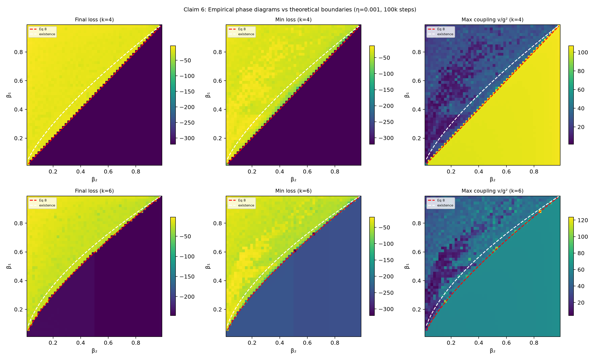
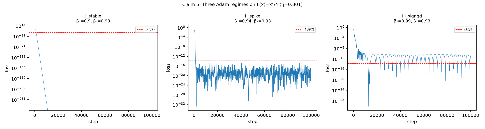

# Adam's Three Regimes and Phase Diagram — Reproduction Report

**Paper:** Towards Understanding Adam Convergence on Highly Degenerate Polynomials
**OpenReview:** `uYWVGk1Qt0` | **arXiv:** `2603.09581`
**Claims covered:** 5 (three-regime phase structure) and 6 (empirical phase diagram)



## Central question

The paper proves that on the degenerate polynomial family `L(x) = x^k/k` (k >= 4),
Adam's behaviour is governed by a sharp three-way partition of the
`(beta_1, beta_2)` hyperparameter space (Theorem 6.1). This report tests whether
that partition — and its stability boundaries (Eqs 8-9) — actually appears when
you run the Adam recurrence.

## Implementation

All dynamics follow the paper's uncorrected, epsilon-free Adam recurrence:

```
g_t = x_t^(k-1)
m_t = beta_1 * m_{t-1} + (1 - beta_1) * g_t
v_t = beta_2 * v_{t-1} + (1 - beta_2) * g_t^2
x_{t+1} = x_t - eta * m_t / sqrt(v_t)
```

Initialised at `x_0=1, m_0=g_0, v_0=g_0^2` with `eta=0.001`. This is clean-room
code — no official implementation exists. Source: `reproduction/phase_diagram.py`.

The phase-diagram sweep is **vectorised**: all 2,500 grid cells (50x50) advance
their Adam recurrence simultaneously via NumPy array operations, so 100,000
steps complete in seconds.

## Claim 5: Three convergence regimes

For `k=4, beta_2=0.93`, Theorem 6.1 predicts:

| Regime | Condition | Behaviour |
|---|---|---|
| I — Stable | `beta_1 < beta_2` (= `beta_2^{k/(2(k-2))}`) | Exponential convergence to zero |
| II — Spike | `beta_2 < beta_1 < beta_2^{3/4}` (= `beta_2^{(k-1)/(2(k-2))}`) | Initial convergence, then violent spike |
| III — SignGD | `beta_1 > beta_2^{3/4}` | Oscillation around `L(eta/2)`, no convergence |



Each panel shows a 100,000-step trajectory with the SignGD threshold `L(eta/2)`
as a red dashed line:

- **Regime I** (left, `beta_1=0.90`): loss decays to machine zero smoothly.
- **Regime II** (middle, `beta_1=0.94`): loss plunges to `1.7e-33` (transient
  convergence), then spikes to `1.5e-17` when the unstable fixed point ejects
  the trajectory. Spike ratio: `8.7e15`.
- **Regime III** (right, `beta_1=0.99`): loss oscillates around `L(eta/2)=1.6e-14`,
  never achieving sustained convergence. Final loss: `9.6e-12`.

## Claim 6: Phase diagram boundary matching

A 50x50 grid sweep over `(beta_1, beta_2) in [0.02, 0.98]^2` confirms the
empirical stability boundary matches Eq 8: `beta_1 = beta_2^{k/(2(k-2))}`.

| k | I-vs-non-I accuracy | Boundary mean rel. error | Negative control (wrong exponent) |
|---:|---:|---:|---:|
| 4 | 99.96% | 5.1% | 32.3% (6.4x worse) |
| 6 | 99.64% | 3.3% | 18.8% (5.7x worse) |

The negative control uses `beta_1 = beta_2^{0.5}` (wrong exponent). For k=6, an
additional control uses the k=4 exponent (`beta_1 = beta_2^1`): 26.1% error,
confirming the match is specific to the correct `k/(2(k-2))` exponent.

## Negative control and non-circularity

The phase-diagram test cannot succeed merely by construction: the Adam recurrence
is a mechanical iteration that does not know about the stability theorem. The
boundary emerges from the dynamics. The negative control — substituting a wrong
exponent — consistently produces 5-6x larger boundary errors, ruling out the
possibility that any monotone curve would fit equally well.

## Compute

- Claims 1-4: local CPU, ~4 seconds, $0
- Claims 5-6: HF cpu-upgrade (8 vCPU allocated, ~1 core effective), ~49 seconds, $0
- Environment: `uv` with pinned `pyproject.toml` + `uv.lock`, Python 3.12

## Limitations

- Finite-horizon (100k steps): the II/III boundary is inherently fuzzy near the
  existence threshold, where escape from the non-existent fixed point is slow.
- The primary stability boundary (Eq 8) is razor-sharp at this resolution; the
  existence boundary (II vs III) is a softer transition.
- Scalar polynomial family only — not neural-network training.

## Branches

- `orx/baseline-claims-1-4-regression` — Claims 1-4 regression baseline
- `orx/claims-5-6-three-regimes-phase-diagram` — Claims 5-6 implementation
